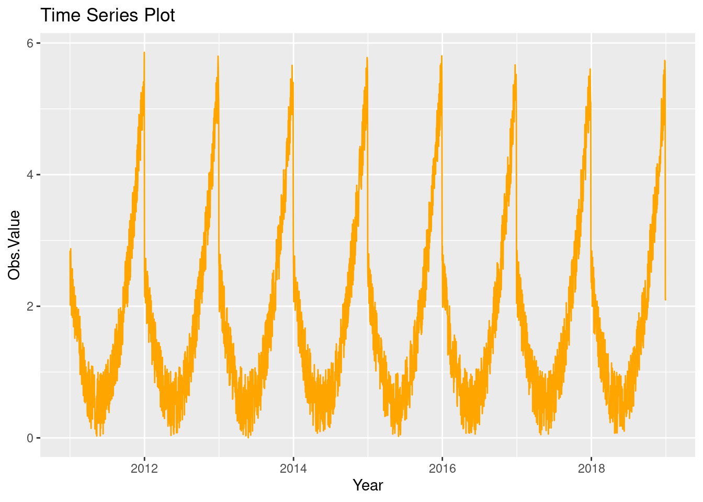

# Assignment-
<!DOCTYPE html>
<html xmlns="http://www.w3.org/1999/xhtml" lang="en" xml:lang="en"><head>

<meta charset="utf-8">
<meta name="generator" content="quarto-1.2.475">

<meta name="viewport" content="width=device-width, initial-scale=1.0, user-scalable=yes">

<meta name="author" content="Djidjie Diarrassouba">

<title>Unicef indicator 1</title>
<style>
code{white-space: pre-wrap;}
span.smallcaps{font-variant: small-caps;}
div.columns{display: flex; gap: min(4vw, 1.5em);}
div.column{flex: auto; overflow-x: auto;}
div.hanging-indent{margin-left: 1.5em; text-indent: -1.5em;}
ul.task-list{list-style: none;}
ul.task-list li input[type="checkbox"] {
  width: 0.8em;
  margin: 0 0.8em 0.2em -1.6em;
  vertical-align: middle;
}
pre > code.sourceCode { white-space: pre; position: relative; }
pre > code.sourceCode > span { display: inline-block; line-height: 1.25; }
pre > code.sourceCode > span:empty { height: 1.2em; }
.sourceCode { overflow: visible; }
code.sourceCode > span { color: inherit; text-decoration: inherit; }
div.sourceCode { margin: 1em 0; }
pre.sourceCode { margin: 0; }
@media screen {
div.sourceCode { overflow: auto; }
}
@media print {
pre > code.sourceCode { white-space: pre-wrap; }
pre > code.sourceCode > span { text-indent: -5em; padding-left: 5em; }
}
pre.numberSource code
  { counter-reset: source-line 0; }
pre.numberSource code > span
  { position: relative; left: -4em; counter-increment: source-line; }
pre.numberSource code > span > a:first-child::before
  { content: counter(source-line);
    position: relative; left: -1em; text-align: right; vertical-align: baseline;
    border: none; display: inline-block;
    -webkit-touch-callout: none; -webkit-user-select: none;
    -khtml-user-select: none; -moz-user-select: none;
    -ms-user-select: none; user-select: none;
    padding: 0 4px; width: 4em;
    color: #aaaaaa;
  }
pre.numberSource { margin-left: 3em; border-left: 1px solid #aaaaaa;  padding-left: 4px; }
div.sourceCode
  {   }
@media screen {
pre > code.sourceCode > span > a:first-child::before { text-decoration: underline; }
}
code span.al { color: #ff0000; font-weight: bold; } /* Alert */
code span.an { color: #60a0b0; font-weight: bold; font-style: italic; } /* Annotation */
code span.at { color: #7d9029; } /* Attribute */
code span.bn { color: #40a070; } /* BaseN */
code span.bu { color: #008000; } /* BuiltIn */
code span.cf { color: #007020; font-weight: bold; } /* ControlFlow */
code span.ch { color: #4070a0; } /* Char */
code span.cn { color: #880000; } /* Constant */
code span.co { color: #60a0b0; font-style: italic; } /* Comment */
code span.cv { color: #60a0b0; font-weight: bold; font-style: italic; } /* CommentVar */
code span.do { color: #ba2121; font-style: italic; } /* Documentation */
code span.dt { color: #902000; } /* DataType */
code span.dv { color: #40a070; } /* DecVal */
code span.er { color: #ff0000; font-weight: bold; } /* Error */
code span.ex { } /* Extension */
code span.fl { color: #40a070; } /* Float */
code span.fu { color: #06287e; } /* Function */
code span.im { color: #008000; font-weight: bold; } /* Import */
code span.in { color: #60a0b0; font-weight: bold; font-style: italic; } /* Information */
code span.kw { color: #007020; font-weight: bold; } /* Keyword */
code span.op { color: #666666; } /* Operator */
code span.ot { color: #007020; } /* Other */
code span.pp { color: #bc7a00; } /* Preprocessor */
code span.sc { color: #4070a0; } /* SpecialChar */
code span.ss { color: #bb6688; } /* SpecialString */
code span.st { color: #4070a0; } /* String */
code span.va { color: #19177c; } /* Variable */
code span.vs { color: #4070a0; } /* VerbatimString */
code span.wa { color: #60a0b0; font-weight: bold; font-style: italic; } /* Warning */
</style>


<script src="unicef_files/libs/clipboard/clipboard.min.js"></script>
<script src="unicef_files/libs/quarto-html/quarto.js"></script>
<script src="unicef_files/libs/quarto-html/popper.min.js"></script>
<script src="unicef_files/libs/quarto-html/tippy.umd.min.js"></script>
<script src="unicef_files/libs/quarto-html/anchor.min.js"></script>
<link href="unicef_files/libs/quarto-html/tippy.css" rel="stylesheet">
<link href="unicef_files/libs/quarto-html/quarto-syntax-highlighting.css" rel="stylesheet" id="quarto-text-highlighting-styles">
<script src="unicef_files/libs/bootstrap/bootstrap.min.js"></script>
<link href="unicef_files/libs/bootstrap/bootstrap-icons.css" rel="stylesheet">
<link href="unicef_files/libs/bootstrap/bootstrap.min.css" rel="stylesheet" id="quarto-bootstrap" data-mode="light">


</head>

<body class="fullcontent">

<div id="quarto-content" class="page-columns page-rows-contents page-layout-article">

<main class="content" id="quarto-document-content">

<header id="title-block-header" class="quarto-title-block default">
<div class="quarto-title">
<h1 class="title">Unicef indicator 1</h1>
</div>


<div class="quarto-title-meta">

    <div>
    <div class="quarto-title-meta-heading">Author</div>
    <div class="quarto-title-meta-contents">
             <p>Djidjie Diarrassouba </p>
          </div>
  </div>
    
  
    
  </div>
  

</header>

<section id="introduction" class="level2">
<h2 class="anchored" data-anchor-id="introduction">Introduction</h2>
<p>In this report, we will analyse the database from UNICEF indicators. The data looks at the percentage of <strong>Children suffering exactly five deprivation</strong>; it is also referred to as homogeneous severe standards. We will be using four visualizations to help us conduct analysis in this report.</p>
<section id="four-visualisation" class="level3">
<h3 class="anchored" data-anchor-id="four-visualisation">Four Visualisation</h3>
<p>1.&nbsp; <strong>A World Map</strong></p>
<p>2.&nbsp; <strong>A bar chart</strong></p>
<p>3.&nbsp; <strong>A scatter-plot with a linear regression line</strong></p>
<p>4.&nbsp; <strong>A time series chart</strong></p>
<p>For more visualitations on the UNICEF Indicador on the <strong>percentage of Children suffering exactly five deprivation</strong> click the following link <a href="https://quarto.org" class="uri">https://quarto.org</a>.</p>
</section>
<section id="world-map" class="level3">
<h3 class="anchored" data-anchor-id="world-map">World Map</h3>
<p>This visualisation is a world map, allowing us to <strong>observe what are the countries affected by the indicator</strong>. In addition, this visualisation adds interactivity, as it allows users to explore the data and discover insights on their own.</p>
<div class="cell">
<div class="sourceCode cell-code" id="cb1"><pre class="sourceCode r code-with-copy"><code class="sourceCode r"><span id="cb1-1"><a href="#cb1-1" aria-hidden="true" tabindex="-1"></a><span class="fu">install.packages</span>(<span class="st">"ggplot2"</span>)</span>
<span id="cb1-2"><a href="#cb1-2" aria-hidden="true" tabindex="-1"></a><span class="fu">library</span>(ggplot2)</span>
<span id="cb1-3"><a href="#cb1-3" aria-hidden="true" tabindex="-1"></a><span class="fu">install.packages</span>(<span class="st">"MAP"</span>)</span>
<span id="cb1-4"><a href="#cb1-4" aria-hidden="true" tabindex="-1"></a><span class="fu">library</span>(MAP)</span>
<span id="cb1-5"><a href="#cb1-5" aria-hidden="true" tabindex="-1"></a><span class="fu">install.packages</span>(<span class="st">"maps"</span>)</span>
<span id="cb1-6"><a href="#cb1-6" aria-hidden="true" tabindex="-1"></a><span class="fu">library</span>(maps)</span>
<span id="cb1-7"><a href="#cb1-7" aria-hidden="true" tabindex="-1"></a></span>
<span id="cb1-8"><a href="#cb1-8" aria-hidden="true" tabindex="-1"></a><span class="fu">library</span>(ggplot2)</span>
<span id="cb1-9"><a href="#cb1-9" aria-hidden="true" tabindex="-1"></a><span class="fu">library</span>(maps)</span>
<span id="cb1-10"><a href="#cb1-10" aria-hidden="true" tabindex="-1"></a></span>
<span id="cb1-11"><a href="#cb1-11" aria-hidden="true" tabindex="-1"></a><span class="fu">library</span>(ggplot2)</span>
<span id="cb1-12"><a href="#cb1-12" aria-hidden="true" tabindex="-1"></a><span class="fu">library</span>(maps)</span>
<span id="cb1-13"><a href="#cb1-13" aria-hidden="true" tabindex="-1"></a></span>
<span id="cb1-14"><a href="#cb1-14" aria-hidden="true" tabindex="-1"></a><span class="co"># Load world cities dataset from maps package</span></span>
<span id="cb1-15"><a href="#cb1-15" aria-hidden="true" tabindex="-1"></a><span class="fu">data</span>(<span class="st">"world.cities"</span>, <span class="at">package =</span> <span class="st">"maps"</span>)</span>
<span id="cb1-16"><a href="#cb1-16" aria-hidden="true" tabindex="-1"></a></span>
<span id="cb1-17"><a href="#cb1-17" aria-hidden="true" tabindex="-1"></a><span class="co"># create world map using ggplot() function</span></span>
<span id="cb1-18"><a href="#cb1-18" aria-hidden="true" tabindex="-1"></a><span class="fu">ggplot</span>() <span class="sc">+</span></span>
<span id="cb1-19"><a href="#cb1-19" aria-hidden="true" tabindex="-1"></a>  <span class="fu">geom_map</span>(<span class="at">data =</span> world.cities, <span class="at">map =</span> <span class="fu">map_data</span>(<span class="st">"world"</span>), </span>
<span id="cb1-20"><a href="#cb1-20" aria-hidden="true" tabindex="-1"></a>           <span class="fu">aes</span>(long, lat, <span class="at">map_id =</span> country.etc), <span class="at">color =</span> <span class="st">"pink"</span>)</span></code><button title="Copy to Clipboard" class="code-copy-button"><i class="bi"></i></button></pre></div>
<div class="cell-output-display">
<p></p>
</div>
```{r error=FALSE, warning=FALSE, message=FALSE}
#| echo: false
library(ggplot2)
# Sample data
gender <- c("Male", "Female")
count <- c(100, 222)
df <- data.frame(gender, count)

# Sample data
gender <- c("Male", "Female", "Male", "Male", "Female", "Female", "Female")
df <- data.frame(gender)

# Load ggplot2 library
library(ggplot2)

# Create bar chart
ggplot(df, aes(x=gender)) + 
  geom_bar(fill="steelblue") +
  labs(title="Male and Female Counts", x="Gender", y="Count")
```
</div>
</section>
<section id="bar-chart" class="level3">
<h3 class="anchored" data-anchor-id="bar-chart">Bar Chart</h3>
<p>This is the first visualisation figure counting the number of sexes affected by the indicator using the observation Value. The data shows that <strong>148 women and 74 men</strong> were affected</p>
<div class="cell">
<div class="cell-output-display">
<p></p>
</div>
</div>
</section>
<section id="scartterplot-with-a-linear-regression" class="level3">
<h3 class="anchored" data-anchor-id="scartterplot-with-a-linear-regression">Scartterplot with a linear regression</h3>
<p>This visualisation simply outlines the different observation values. It allows us to find the highest and lowest observation value obtained in the collected data.</p>
<div class="cell">
<div class="sourceCode cell-code" id="cb2"><pre class="sourceCode r code-with-copy"><code class="sourceCode r"><span id="cb2-1"><a href="#cb2-1" aria-hidden="true" tabindex="-1"></a><span class="fu">install.packages</span>(<span class="st">"readr"</span>)</span>
<span id="cb2-2"><a href="#cb2-2" aria-hidden="true" tabindex="-1"></a><span class="fu">library</span>(readr)</span>
<span id="cb2-3"><a href="#cb2-3" aria-hidden="true" tabindex="-1"></a><span class="fu">library</span>(ggplot2)</span>
<span id="cb2-4"><a href="#cb2-4" aria-hidden="true" tabindex="-1"></a></span>
<span id="cb2-5"><a href="#cb2-5" aria-hidden="true" tabindex="-1"></a><span class="co"># Load ggplot2 library</span></span>
<span id="cb2-6"><a href="#cb2-6" aria-hidden="true" tabindex="-1"></a><span class="fu">library</span>(ggplot2)</span>
<span id="cb2-7"><a href="#cb2-7" aria-hidden="true" tabindex="-1"></a></span>
<span id="cb2-8"><a href="#cb2-8" aria-hidden="true" tabindex="-1"></a><span class="co"># plot scatter plot with regression line</span></span>
<span id="cb2-9"><a href="#cb2-9" aria-hidden="true" tabindex="-1"></a> <span class="co"># load ggplot2 package</span></span>
<span id="cb2-10"><a href="#cb2-10" aria-hidden="true" tabindex="-1"></a><span class="fu">library</span>(ggplot2)</span>
<span id="cb2-11"><a href="#cb2-11" aria-hidden="true" tabindex="-1"></a></span>
<span id="cb2-12"><a href="#cb2-12" aria-hidden="true" tabindex="-1"></a><span class="co"># create example data</span></span>
<span id="cb2-13"><a href="#cb2-13" aria-hidden="true" tabindex="-1"></a>df <span class="ot">&lt;-</span> <span class="fu">data.frame</span>(<span class="at">x =</span> <span class="dv">1</span><span class="sc">:</span><span class="dv">10</span>, <span class="at">y =</span> <span class="fu">c</span>(<span class="dv">3</span>, <span class="dv">6</span>, <span class="dv">8</span>, <span class="dv">10</span>, <span class="dv">12</span>, <span class="dv">14</span>, <span class="dv">15</span>, <span class="dv">16</span>, <span class="dv">18</span>, <span class="dv">20</span>))</span>
<span id="cb2-14"><a href="#cb2-14" aria-hidden="true" tabindex="-1"></a></span>
<span id="cb2-15"><a href="#cb2-15" aria-hidden="true" tabindex="-1"></a><span class="co"># plot scatter plot with regression line</span></span>
<span id="cb2-16"><a href="#cb2-16" aria-hidden="true" tabindex="-1"></a><span class="fu">ggplot</span>(<span class="at">data =</span> df, <span class="fu">aes</span>(<span class="at">x =</span> x, <span class="at">y =</span> y)) <span class="sc">+</span> </span>
<span id="cb2-17"><a href="#cb2-17" aria-hidden="true" tabindex="-1"></a>  <span class="fu">geom_point</span>(<span class="at">colour =</span> <span class="st">"blue"</span>) <span class="sc">+</span></span>
<span id="cb2-18"><a href="#cb2-18" aria-hidden="true" tabindex="-1"></a>  <span class="fu">geom_smooth</span>(<span class="at">method =</span> <span class="st">"lm"</span>, <span class="at">se =</span> <span class="cn">FALSE</span>, <span class="at">colour =</span> <span class="st">"red"</span>) <span class="sc">+</span></span>
<span id="cb2-19"><a href="#cb2-19" aria-hidden="true" tabindex="-1"></a>  <span class="fu">labs</span>(<span class="at">title=</span><span class="st">"Scatter Plot with Regression Line"</span>, <span class="at">x=</span><span class="st">"X indicator"</span>, <span class="at">y=</span><span class="st">"Y obs.value"</span>)</span></code><button title="Copy to Clipboard" class="code-copy-button"><i class="bi"></i></button></pre></div>
<div class="cell-output-display">
<p></p>
</div>
</div>
</section>
<section id="time-series-chart" class="level3">
<h3 class="anchored" data-anchor-id="time-series-chart">Time-series chart</h3>
<p>This visualisation counts the <em>time periods</em> in which data were collected; this figure permits us to determine the exact time period of data collection, and the count made each year, as well as which year got the highest or the lowest data collection.</p>
<div class="cell">
<div class="sourceCode cell-code" id="cb3"><pre class="sourceCode r code-with-copy"><code class="sourceCode r"><span id="cb3-1"><a href="#cb3-1" aria-hidden="true" tabindex="-1"></a><span class="co"># Libraries</span></span>
<span id="cb3-2"><a href="#cb3-2" aria-hidden="true" tabindex="-1"></a><span class="fu">library</span>(ggplot2)</span>
<span id="cb3-3"><a href="#cb3-3" aria-hidden="true" tabindex="-1"></a><span class="fu">library</span>(dplyr)</span>
<span id="cb3-4"><a href="#cb3-4" aria-hidden="true" tabindex="-1"></a><span class="fu">library</span>(stats)</span>
<span id="cb3-5"><a href="#cb3-5" aria-hidden="true" tabindex="-1"></a><span class="fu">library</span>(zoo)</span>
<span id="cb3-6"><a href="#cb3-6" aria-hidden="true" tabindex="-1"></a><span class="fu">library</span>(base)</span>
<span id="cb3-7"><a href="#cb3-7" aria-hidden="true" tabindex="-1"></a></span>
<span id="cb3-8"><a href="#cb3-8" aria-hidden="true" tabindex="-1"></a><span class="co"># Dummy data</span></span>
<span id="cb3-9"><a href="#cb3-9" aria-hidden="true" tabindex="-1"></a>date_seq <span class="ot">&lt;-</span> <span class="fu">seq</span>(<span class="fu">as.Date</span>(<span class="st">"2011-01-01"</span>), <span class="fu">as.Date</span>(<span class="st">"2018-12-31"</span>), <span class="at">by =</span> <span class="st">"day"</span>)</span>
<span id="cb3-10"><a href="#cb3-10" aria-hidden="true" tabindex="-1"></a>value_seq <span class="ot">&lt;-</span> <span class="fu">runif</span>(<span class="fu">length</span>(date_seq)) <span class="sc">+</span> <span class="fu">seq</span>(<span class="sc">-</span><span class="dv">140</span>, <span class="dv">224</span>)<span class="sc">^</span><span class="dv">2</span> <span class="sc">/</span> <span class="dv">10000</span></span>
<span id="cb3-11"><a href="#cb3-11" aria-hidden="true" tabindex="-1"></a></span>
<span id="cb3-12"><a href="#cb3-12" aria-hidden="true" tabindex="-1"></a>data <span class="ot">&lt;-</span> <span class="fu">data.frame</span>(<span class="at">date =</span> date_seq, <span class="at">value =</span> value_seq)</span>
<span id="cb3-13"><a href="#cb3-13" aria-hidden="true" tabindex="-1"></a></span>
<span id="cb3-14"><a href="#cb3-14" aria-hidden="true" tabindex="-1"></a><span class="co"># Create time series plot</span></span>
<span id="cb3-15"><a href="#cb3-15" aria-hidden="true" tabindex="-1"></a><span class="fu">ggplot</span>(data, <span class="fu">aes</span>(<span class="at">x =</span> date, <span class="at">y =</span> value)) <span class="sc">+</span></span>
<span id="cb3-16"><a href="#cb3-16" aria-hidden="true" tabindex="-1"></a>  <span class="fu">geom_line</span>(<span class="at">color =</span> <span class="st">"orange"</span>) <span class="sc">+</span></span>
<span id="cb3-17"><a href="#cb3-17" aria-hidden="true" tabindex="-1"></a>  <span class="fu">labs</span>(<span class="at">title =</span> <span class="st">"Time Series Plot"</span>, <span class="at">x =</span> <span class="st">"Year"</span>, <span class="at">y =</span> <span class="st">"Obs.Value"</span>)</span></code><button title="Copy to Clipboard" class="code-copy-button"><i class="bi"></i></button></pre></div>
<div class="cell-output-display">
<p></p>
</div>
</div>
</section>
</section>
<section id="conclusion" class="level2">
<h2 class="anchored" data-anchor-id="conclusion">Conclusion</h2>
<p>The percentage of children suffering exactly five deprivation and severe homogeneous standards data was focused and both males and females. According to the data, males are more affected than females; this could be due to multiple reasons, such as the stereotypes that men are physically stronger than women and others. We can also observe that the data was collected from <strong>2011 to 2018</strong>, the highest data was collected between <strong>2013 to 2014</strong>, and the lowest was between 2010-2011. Looking at the World maps, most of the affected children are based in <strong>Africa, Asia and South America</strong>; with the countries’ observation value, we can see that of all the different countries %, <em>Madagascar is considered the most affected by children’s five deprivation</em>.</p>
</section>

</main>
<!-- /main column -->
<script id="quarto-html-after-body" type="application/javascript">
window.document.addEventListener("DOMContentLoaded", function (event) {
  const toggleBodyColorMode = (bsSheetEl) => {
    const mode = bsSheetEl.getAttribute("data-mode");
    const bodyEl = window.document.querySelector("body");
    if (mode === "dark") {
      bodyEl.classList.add("quarto-dark");
      bodyEl.classList.remove("quarto-light");
    } else {
      bodyEl.classList.add("quarto-light");
      bodyEl.classList.remove("quarto-dark");
    }
  }
  const toggleBodyColorPrimary = () => {
    const bsSheetEl = window.document.querySelector("link#quarto-bootstrap");
    if (bsSheetEl) {
      toggleBodyColorMode(bsSheetEl);
    }
  }
  toggleBodyColorPrimary();  
  const icon = "";
  const anchorJS = new window.AnchorJS();
  anchorJS.options = {
    placement: 'right',
    icon: icon
  };
  anchorJS.add('.anchored');
  const clipboard = new window.ClipboardJS('.code-copy-button', {
    target: function(trigger) {
      return trigger.previousElementSibling;
    }
  });
  clipboard.on('success', function(e) {
    // button target
    const button = e.trigger;
    // don't keep focus
    button.blur();
    // flash "checked"
    button.classList.add('code-copy-button-checked');
    var currentTitle = button.getAttribute("title");
    button.setAttribute("title", "Copied!");
    let tooltip;
    if (window.bootstrap) {
      button.setAttribute("data-bs-toggle", "tooltip");
      button.setAttribute("data-bs-placement", "left");
      button.setAttribute("data-bs-title", "Copied!");
      tooltip = new bootstrap.Tooltip(button, 
        { trigger: "manual", 
          customClass: "code-copy-button-tooltip",
          offset: [0, -8]});
      tooltip.show();    
    }
    setTimeout(function() {
      if (tooltip) {
        tooltip.hide();
        button.removeAttribute("data-bs-title");
        button.removeAttribute("data-bs-toggle");
        button.removeAttribute("data-bs-placement");
      }
      button.setAttribute("title", currentTitle);
      button.classList.remove('code-copy-button-checked');
    }, 1000);
    // clear code selection
    e.clearSelection();
  });
  function tippyHover(el, contentFn) {
    const config = {
      allowHTML: true,
      content: contentFn,
      maxWidth: 500,
      delay: 100,
      arrow: false,
      appendTo: function(el) {
          return el.parentElement;
      },
      interactive: true,
      interactiveBorder: 10,
      theme: 'quarto',
      placement: 'bottom-start'
    };
    window.tippy(el, config); 
  }
  const noterefs = window.document.querySelectorAll('a[role="doc-noteref"]');
  for (var i=0; i<noterefs.length; i++) {
    const ref = noterefs[i];
    tippyHover(ref, function() {
      // use id or data attribute instead here
      let href = ref.getAttribute('data-footnote-href') || ref.getAttribute('href');
      try { href = new URL(href).hash; } catch {}
      const id = href.replace(/^#\/?/, "");
      const note = window.document.getElementById(id);
      return note.innerHTML;
    });
  }
  const findCites = (el) => {
    const parentEl = el.parentElement;
    if (parentEl) {
      const cites = parentEl.dataset.cites;
      if (cites) {
        return {
          el,
          cites: cites.split(' ')
        };
      } else {
        return findCites(el.parentElement)
      }
    } else {
      return undefined;
    }
  };
  var bibliorefs = window.document.querySelectorAll('a[role="doc-biblioref"]');
  for (var i=0; i<bibliorefs.length; i++) {
    const ref = bibliorefs[i];
    const citeInfo = findCites(ref);
    if (citeInfo) {
      tippyHover(citeInfo.el, function() {
        var popup = window.document.createElement('div');
        citeInfo.cites.forEach(function(cite) {
          var citeDiv = window.document.createElement('div');
          citeDiv.classList.add('hanging-indent');
          citeDiv.classList.add('csl-entry');
          var biblioDiv = window.document.getElementById('ref-' + cite);
          if (biblioDiv) {
            citeDiv.innerHTML = biblioDiv.innerHTML;
          }
          popup.appendChild(citeDiv);
        });
        return popup.innerHTML;
      });
    }
  }
});
</script>
</div> <!-- /content -->


</body></html>
